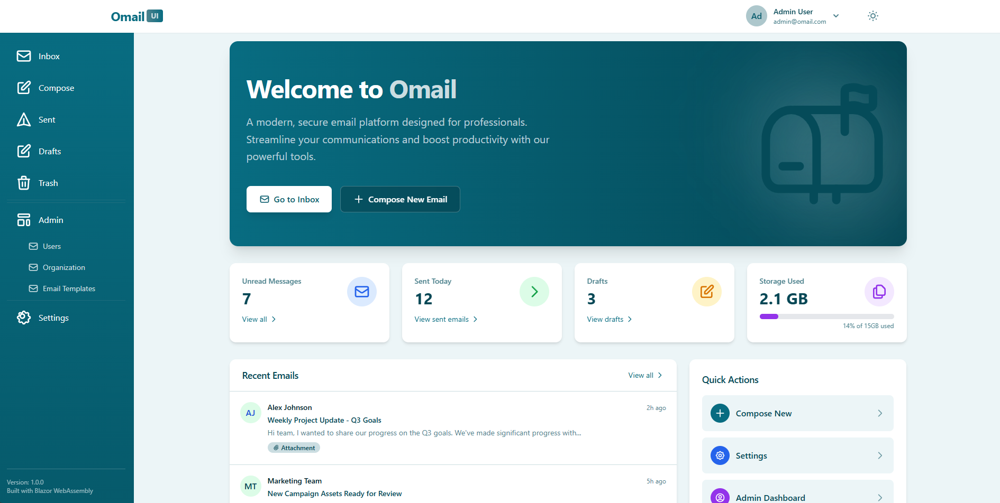
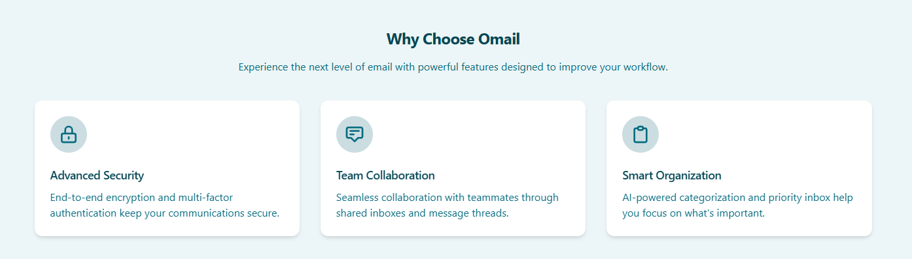
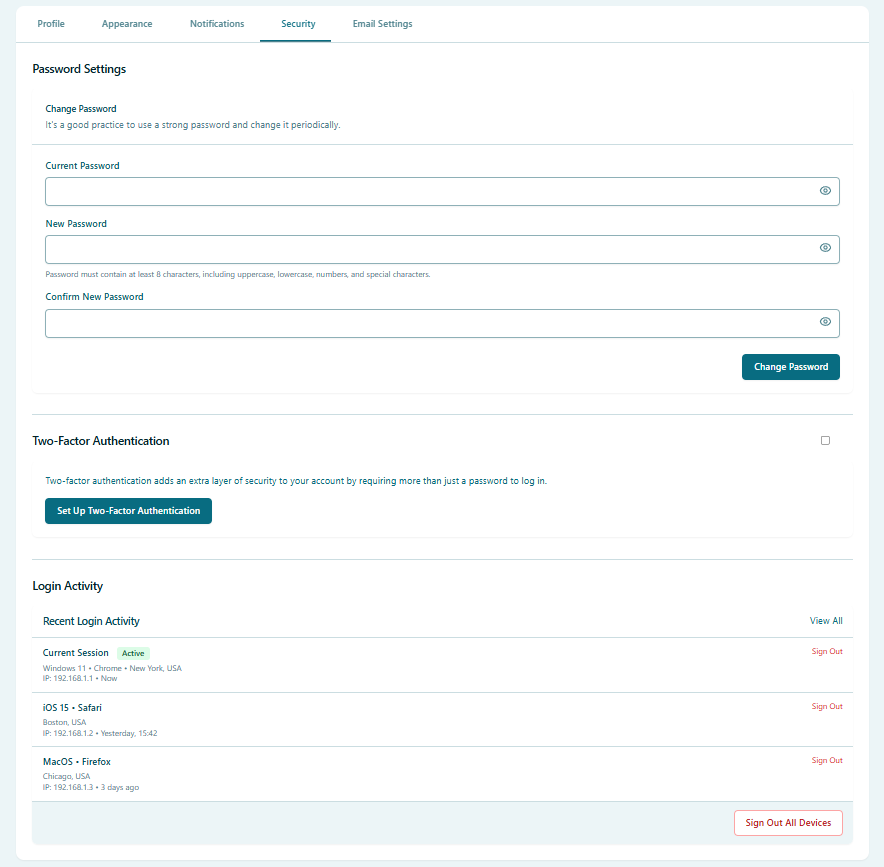
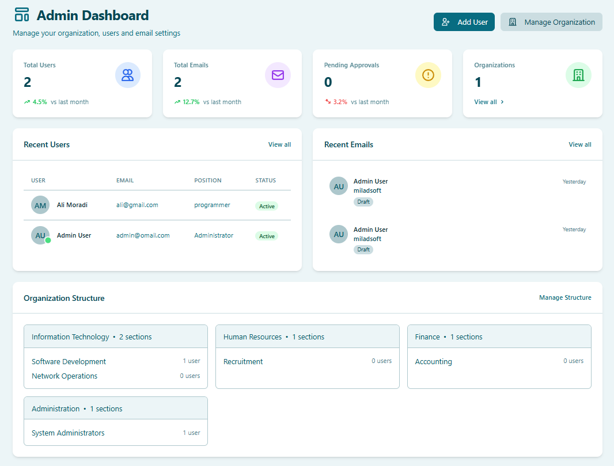

[النسخة العربية (Arabic Version)](README.ar.md)

# 📧 Omail: Secure Internal Communication for Organizations

 
## 🌟 Enterprise Email System Built for Your Organization

**Omail** transforms how your organization communicates internally, providing a secure, structured, and efficient email platform specifically designed for modern enterprises. Unlike conventional email services, Omail is built from the ground up with organizational hierarchies and business workflows in mind.

 

---

## 📋 What is Omail?

Omail is a complete internal email solution that enables:

- 🔒 **Secure communications** that never leave your organization's network
- 🏢 **Department-based email routing** that mirrors your organizational structure
- ✅ **Approval workflows** for sensitive or official communications
- 👥 **Team collaboration** within departments and across the organization
- 📊 **Comprehensive analytics** for communication patterns and efficiency

Unlike public email services, Omail is designed exclusively for internal communication, ensuring that sensitive company information remains protected while streamlining operational efficiency.

 

---

## 🛡️ Enhanced Security for Business Communications

In today's digital landscape, communication security is paramount. Omail addresses this critical need by providing:

- 🔐 **End-to-end security** for all internal communications
- 🚫 **No external exposure** - emails never leave your secure corporate network
- 👤 **Role-based access controls** ensuring information reaches only authorized personnel
- 🔍 **Comprehensive audit trails** for compliance and security oversight
- 🛑 **Data loss prevention** built into the platform's core

With Omail, your sensitive internal communications remain protected from external threats, reducing the risk of data breaches and information leaks.

 

---

## 🏢 Organization Structure Integration

Omail doesn't just send emails—it understands your organization:

### Mirrors Your Organization Structure
- 📂 Automatically organizes communications by department, division, and team
- 👥 User roles and permissions aligned with your organizational hierarchy
- 🔄 Adapts as your organization grows and changes

### Smart Routing and Organization
- 📨 Easily target messages to entire departments or teams with smart distribution lists
- 🏷️ Automatic email categorization based on organizational context
- 🔎 Powerful search that understands departmental relationships

 

---

## ✅ Manager Approval Workflow System

Ensure important communications follow proper channels with our robust approval system:

### How It Works:
1. 📝 Employee composes an official communication
2. 🕐 Message enters the approval queue for designated managers
3. 👀 Manager reviews, edits if needed, and approves or rejects
4. ✉️ Upon approval, the message is distributed to recipients
5. 📊 Full tracking of approval status and history

### Benefits:
- ✓ Ensures consistent and accurate official communications
- ✓ Prevents unauthorized sensitive information distribution
- ✓ Creates accountability and proper oversight
- ✓ Streamlines approval processes with notifications and reminders

 
---

## 💼 Business Use Cases

Omail transforms internal communications across multiple scenarios:

### Executive Communications
- 📣 Leadership announcements distributed with proper oversight
- 📊 Quarterly results shared securely with appropriate departments
- 🎯 Strategic initiatives communicated with controlled distribution

### HR Processes
- 👥 New policy announcements with tracked readership
- 🎓 Training opportunities targeted to relevant departments
- 🎉 Company-wide event coordination with response tracking

### Departmental Collaboration
- 🤝 Cross-functional project communications
- 📄 Document sharing with proper access controls
- 💡 Idea submission and feedback workflows

### Regulated Industries
- ⚖️ Compliance-friendly communication with audit trails
- 📜 Record retention built into the system
- 🔏 Information classification and handling

---

## 🚀 Key Features & Benefits

### User Experience
- 📱 **Works Everywhere:** Responsive design for desktop, tablet, and mobile devices
- 🌙 **Eye-Friendly Design:** Beautiful dark mode option reduces eye strain
- 🔔 **Smart Notifications:** Stay informed of important messages without being overwhelmed

### Email Management
- 📥 **Complete Workflow:** Full-featured inbox, sent items, drafts, and archive functions
- 📬 **Smart Categorization:** Automatic filing based on organizational metadata
- 🗄️ **Intelligent Search:** Find any message quickly with powerful search capabilities

### Administration & Control
- 👨‍💼 **Comprehensive Admin Dashboard:** Complete system oversight for administrators
- 📊 **Usage Analytics:** Understand communication patterns and optimize workflows
- 🛠️ **Flexible Configuration:** Adapt the system to your organization's specific needs

### Integration & Accessibility
- 🔄 **Works With Your Systems:** Integrates with your existing enterprise systems
- 🌐 **Available Anywhere:** Access via web browser or dedicated applications
- 📲 **Offline Support:** Continue working even when connectivity is limited

 

---

## 🤔 How Omail Differs From Standard Email

| Feature | Standard Email Services | Omail |
|---------|------------------------|-------|
| **Security** | Emails traverse public networks | Contained within your organization's secure network |
| **Organization** | Basic folders and labels | Department-based structure matching your organization |
| **Approvals** | None or basic rules | Comprehensive approval workflows for controlled communication |
| **Targeting** | Manual distribution lists | Smart groups based on organizational structure |
| **Analytics** | Basic tracking at best | Comprehensive communication pattern analysis |
| **Privacy** | Varies by provider | Complete data sovereignty within your organization |
| **Compliance** | Limited retention controls | Built for regulatory compliance and auditing |

---

## 👨‍💻 User Experience

Omail provides an intuitive experience for all roles in your organization:

### For Regular Users
- 📥 Easy-to-navigate inbox with organization-aware filtering
- ✏️ Streamlined message composition with templates for common communications
- 🏷️ Smart categorization that understands departmental context

### For Managers
- ✅ Efficient approval dashboard for reviewing communications
- 📊 Team communication insights and analytics
- 📑 Delegation capabilities for when you're unavailable

### For Administrators
- ⚙️ Comprehensive controls for system configuration
- 👥 User and department management tools
- 📈 System-wide analytics and reporting

 
---

## 🔒 Privacy & Compliance

Omail is designed with privacy and regulatory compliance at its core:

- 🛡️ **Data Privacy:** All data remains within your organization's control
- 📜 **Compliance Ready:** Built for GDPR, HIPAA, and other regulatory frameworks
- 🗄️ **Record Retention:** Configurable retention policies for compliance requirements
- 📝 **Audit Trails:** Comprehensive logging for security and compliance reviews
- 🔏 **Data Governance:** Tools for implementing your data governance policies

 
---

## 🚀 Getting Started

Implementing Omail in your organization is straightforward:

1. **Initial Consultation:** We work with you to understand your organizational structure
2. **System Setup:** Configuration of the system to match your organization
3. **Integration:** Connection with your existing systems and authentication
4. **User Training:** Comprehensive training for administrators and end-users
5. **Go-Live:** Phased rollout to ensure smooth adoption

Our implementation specialists will guide you through each step, ensuring a smooth transition to more secure and efficient internal communications.

 
---

## 📚 Resources & Support

We're committed to your success with Omail:

- 📞 **Dedicated Support:** Our team is available to address any questions or issues
- 🎓 **Training Materials:** Comprehensive guides for all user roles
- 📱 **Mobile Support:** Apps for iOS and Android for communication on the go
- 🛠️ **Regular Updates:** Ongoing improvements and new features

 
---

## 📋 Frequently Asked Questions

**Q: Can Omail connect with our existing email system?**  
A: Yes, Omail can be configured to integrate with existing email infrastructure while maintaining its enhanced security and organizational features.

**Q: How does Omail handle mobile access?**  
A: Omail offers both responsive web access and dedicated mobile apps for iOS and Android, providing secure access from any device.

**Q: Can we customize approval workflows for different departments?**  
A: Absolutely! Omail allows for customized approval chains based on department, message type, recipient groups, and other factors.

**Q: What happens if an approving manager is unavailable?**  
A: The system includes delegation capabilities and escalation paths to ensure communications aren't delayed when key personnel are unavailable.

**Q: How secure is Omail?**  
A: Omail employs enterprise-grade security measures, including encryption, secure authentication, and operates entirely within your organization's network perimeter.

---

## 🌟 Conclusion

Omail represents the next evolution in organizational communication—secure, structured, and aligned with how modern enterprises actually work. By implementing Omail, your organization can:

- 🔒 **Enhance security** of internal communications
- 📈 **Improve efficiency** with organization-aligned workflows
- 🎯 **Ensure accuracy** of official communications
- 📊 **Gain insights** into communication patterns
- ⚡ **Speed up decisions** with streamlined approvals

Transform your internal communications today with Omail—the email system built specifically for organizations like yours.

 
---

**Contact us today to schedule a demonstration or learn more about implementing Omail in your organization.**

